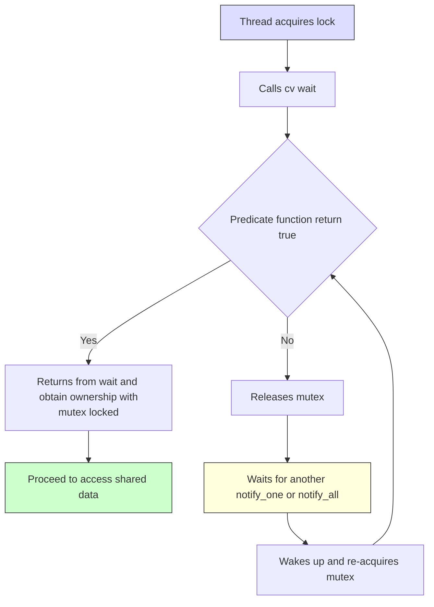

**Concurrency and Multithread**

**Atomic variable**
- Atomic variables (like std::atomic<bool>) ensure safe, lock-free access across threads.
- They always hold exactly one consistent value at a time, even when multiple threads read/write to them.
- Ideal for status flags, such as:
  - one time init
  - stop signal
  - task completion signal

**Mutex**
- `unique_lock` only one thread can access the thread at a time
- `share_lock` usually for reader or substance doesnt modify the resources
- `condition_variable` is used to avoid spurious wakeup (when no element in task queue, but the resources still get locked)


**detach**
- The thread continues to run in the background. The parent thread does not wait for it to finish (join() is never called). When the thread finishes, its resources are automatically cleaned up.
```
t.detach();  // no join() needed
```
