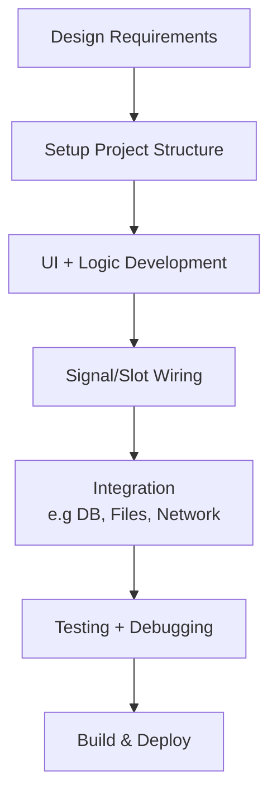

**MVC(model-view-controller) architecture**
```
1. Model
  What it does: Manages data and business logic.
  Qt classes: QAbstractItemModel, QStandardItemModel, custom subclasses.
  Responsibility: Stores, exposes, and updates data.
2. View
  What it does: Presents data to the user.
  Qt classes: QListView, QTableView, QTreeView, custom widgets.
  Responsibility: Fetches data from the model and displays it.
3. Controller
  What it does: Handles user interaction and updates model/view.
  In Qt: Controller logic is distributed:
  The view handles UI events.
  Delegates (QStyledItemDelegate) handle editing/custom rendering.
  Additional logic is often embedded in controllers or the main application logic.
```
*When to Use MVC in Qt*
- You are building data-driven UIs with QListView, QTableView, etc.
- Your application will have multiple views of the same data.
- You want clean separation between data, logic, and presentation.

**Q_OBJECT**
`The Q_OBJECT macro marks a class as a participant in Qt’s meta-object system, enabling it to use advanced Qt features that standard C++ does not support natively. In effect, Q_OBJECT tells the Qt build system to "process this class with Qt's meta-object rules," injecting the glue code required for signals, slots, properties, and runtime type support. When this macro is present:`
- The class can define and emit signals, and declare slots that can be connected to signals.
- It becomes compatible with Qt’s introspection and dynamic property system, allowing runtime type information, property access, and dynamic casting.
- The `MOC` processes the class to generate the necessary boilerplate code to implement these features.
  - The MOC creates a static QMetaObject for the class that enables: QObject::metaObject() , QObject::inherits() , qobject_cast<T*>, Dynamic method/property invocation via QMetaObject::invokeMethod
- With `Q_PROPERTY` macros, you can expose class members to: Qt Designer, Dynamic introspection and serialization, QML bindings

| Feature                         | Requires `Q_OBJECT` | Provided by MOC |
|----------------------------------|---------------------|-----------------|
| Signals and Slots                | ✅                  | ✅              |
| Meta-Object Introspection        | ✅                  | ✅              |
| Dynamic Properties               | ✅                  | ✅              |
| Dynamic Method Invocation        | ✅                  | ✅              |
| QObject Casting (`qobject_cast`) | ✅                  | ✅              |
| Event Filtering                  | ✅                  | ✅              |


**MOC(Meta-Object Compiler)**
he MOC (Meta-Object Compiler) generates additional C++ code that effectively injects key capabilities into the class. These are not standard C++ features but part of Qt's extended runtime system.

**Development**

