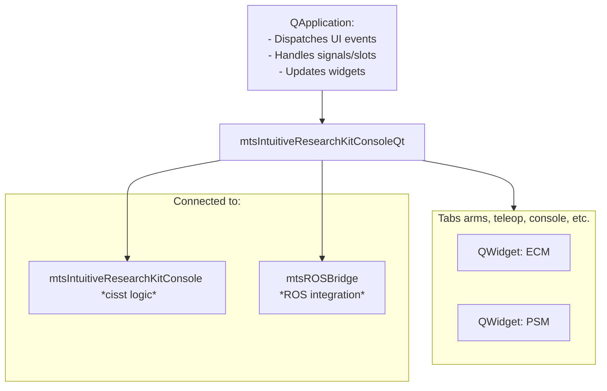
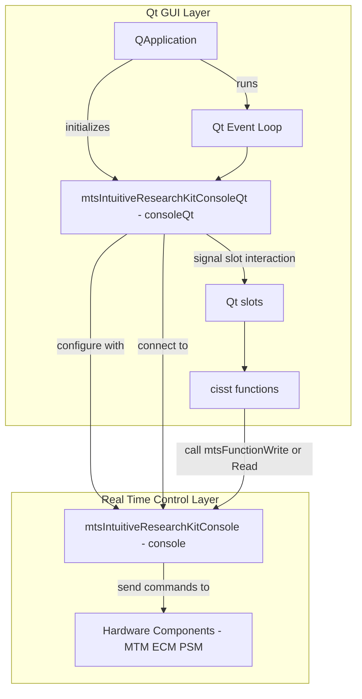
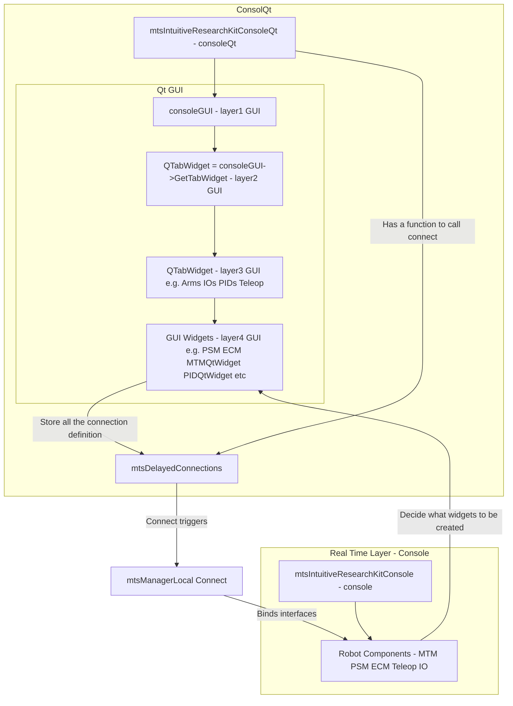

**Qt-Based desktop front-end application**

- the subsystem are wrapped into QtWidget
- the main application can be customly truncated or populated with user inputing the need for those QtWidget


| name | description |
|------|------------------------------------------------------------------------------------------------------|
| mtsIntuitiveResearchKitConsole | defined by JSON and connect to hardware drivers (RobotIO, PSM...) |
| mtsIntuitiveResearchKitConsoleQt | the main front-end user interface and dynamically created acd to console |


- some connection is created but not registered yet by
```
mtsDelayedConnection
```
- the following is an implicit form to connect server and client interface
```
// Connections store the connection definition by
Connections.Add("consoleGUI", "Main", "console", "Main");
// same as mtsLocalManager::connection()
Connections.Connect()
```

