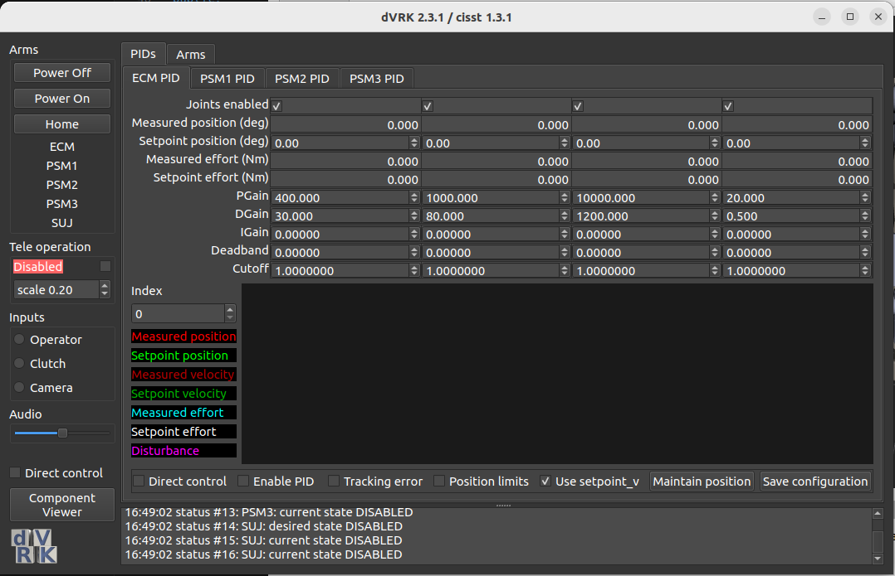

**layout**
- leftside: arm control menu
  - button1: power on
  - button2: power off
  - button3: home
  - status for subsystem1
  - status for subsystem2
  - ...
- leftside: icon (at the bottom)
- rightside: main screen
  - tabwidget1 (arm)
  - tabwidget2 (pid)
- rightside: log screen
  - scrollable widget to display QDebug info