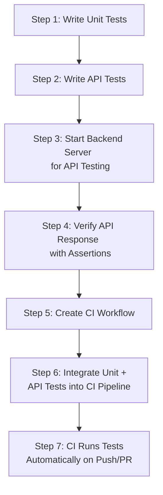
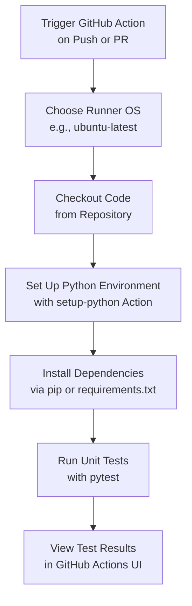
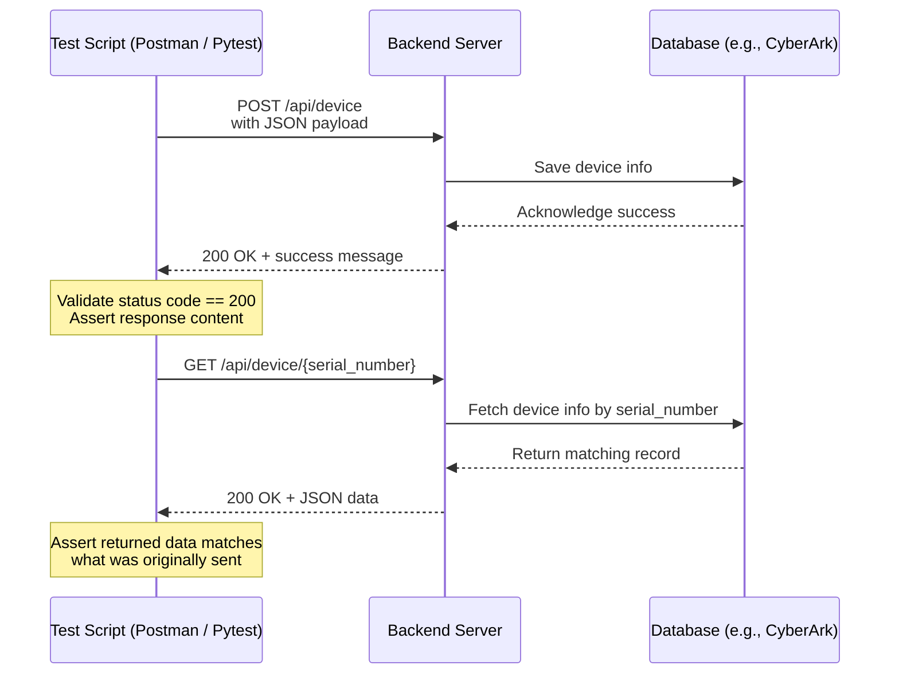

**Summarize the unittest api test and CI/CD**
*Summary: The CI/CD, Unit Test and API Test can be integrated into the project in the following sequence:*

- `CI/CD` can incorporate unittest and API test; it orchestrates and automates the pipeline of compile/test/deploy. The unit test framework like pytest/unitest can be integrated into CI for instance by `github action` which defines a series of actions (in .yaml) to run testing tasks.

- unit test scripts are employed to assure individual function running properly and return expected results. Some external dependencies can be excluded by mocking. It is an effective way to decouple the core function from the external dependencies.

- API tests are performed when you want to test the functionality of REST application. usually need to startup the endpoint server; use get/post to trigger an event or request some information; and use assert to compare the obtained information with the expected infromation. 

